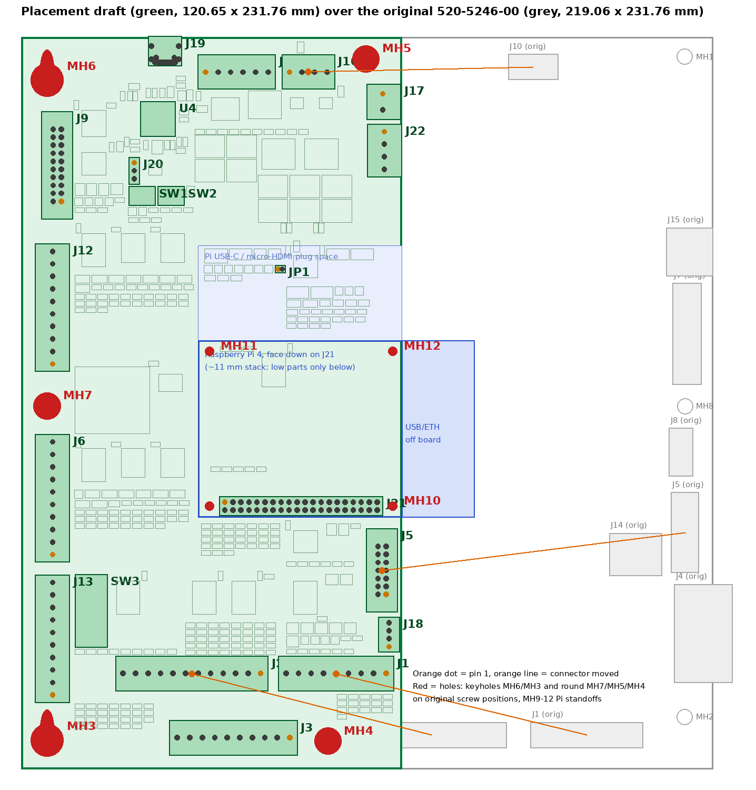

# PCB placement draft (0.4)

`sam_cpu/sam_cpu.kicad_pcb` has the board outline, the mounting holes, the connectors and a first placement of all
456 parts, on **2 copper layers**. Nothing is routed. It matches the schematic (KiCad schematic parity: 0 footprint
errors) and has no courtyard overlaps.



`sam_cpu/pcb_overview.png` shows the new board over the original 520-5246-00 outline, with arrows for the
connectors that moved. `sam_cpu/pcb_render.png` is KiCad's top render.

Coordinates are millimetres from the top-left board corner, Y down, component side, as the board hangs in the
backbox (same frame as `docs/mechanical/`). KiCad's grid and drill origins are set to that corner.

## Outline

**120.65 x 231.76 mm** (4.75 x 9.125 in), 55 % of the original 219.06 mm width, widened to **142 mm below
the Pi (Y 154 to the bottom edge)** for the two HUB75 panel headers and their buffers. Height and the left edge are
unchanged. The width is set by three things: the Pi's USB/Ethernet end must hang past the right edge, the round
hole MH5 at X 109.2 is kept, and the J2 + J1 row needs about 88 mm. 2 copper layers.

## Mounting holes

All on original backbox screw positions (`docs/mechanical/README.md`):

| Hole | Type | Screw X, Y |
|---|---|---|
| MH6 | keyhole, opens upward, top-left | 8.24, 6.27 |
| MH3 | keyhole, opens upward, bottom-left | 8.24, 215.17 |
| MH7 | round, left middle | 8.25, 116.84 |
| MH5 | round, top | 109.20, 6.98 |
| MH4 | round, bottom | 97.14, 222.86 |
| MH9-MH12 | M2.5, Raspberry Pi 4 standoffs | 59.65 / 117.65, 99.5 / 148.5 |

The original right-hand holes (MH1, MH8, MH2) fall outside the narrower board. The round holes use a 4.3 mm plated
pad (M4) until the real screw is measured.

## Connectors (pin 1 position)

| Conn | Function | Pin 1 X, Y | Original pin 1 | Change |
|---|---|---|---|---|
| J9 | IO bus 2x10 | 12.70, 52.07 | same | none |
| J12 | switch returns 9-16 | 10.03, 103.51 | same | none |
| J6 | switch returns 1-8 | 10.03, 163.83 | same | none |
| J13 | dedicated 17-24 | 10.03, 208.28 | same | none |
| J3 | dedicated in (upper) | 85.09, 221.73 | same | none |
| J2 | dedicated in (lower), 12 pin | 75.85, 201.41 | 151.77, 221.73 | 76 mm left, second row 20.3 mm up |
| J1 | switch strobes, 9 pin | 115.57, 201.41 | 194.94, 221.73 | 79 mm left, second row 20.3 mm up |
| J11 | power in | 58.41, 11.18 | same | none |
| J10 | speakers (now bridged: L+ R+ L- R-) | 85.00, 11.18 | 156.19, 8.76 | 71 mm left |
| J5 | DMD 2x7 | 115.57, 176.46 | 211.44, 164.46 | 96 mm left, 12 mm down |
| J17 | external +5 V terminal, wires from the right edge | 114.5, 18.0 | new | |
| J23 | external +12 V terminal (audio), wires from the right edge | 114.5, 30.0 | new | |
| J22 | second speaker connector (L+ L- R+ R-) | 115.0, 41.5 | new | right edge |
| J24 | subwoofer (SUB1+ SUB1- SUB2+ SUB2-) | 115.0, 59.5 | new | right edge |
| J18 | GI dimmer header | 116.5, 193.0 | new | |
| J19 | USB-C to the Pi, on the top edge | centre X 45.6 | new | 13 mm from the RP2354B USB pins |
| J21 | Raspberry Pi 40-pin socket | 64.52, 147.23 | new | |
| J25 | HD DMD panel A, HUB75 2x8 | 124.6, 160.0 | new | extension, right of J5 |
| J26 | HD DMD panel B, HUB75 2x8 | 135.4, 160.0 | new | extension, right of J25 |

The KK-396 headers keep the original orientation: pin 1 at the bottom of the left-edge connectors and at the right
end of the bottom ones, friction ramp toward the board centre. J3 stays in the bottom row; J2 and J1 form a second
row above it, keeping the left-to-right order J3 / J2 / J1 so the harness branches do not cross.

## Raspberry Pi 4

Assumed mounted **face down** on J21 (female 2x20 socket on this board), about 11 mm above the board, with its
USB/Ethernet end hanging past the right edge and its micro-SD card facing out. Under the Pi only low SMD parts
(under ~3 mm) can go. Its USB-C and micro-HDMI plugs point toward the top of the board; the area above the Pi is
for low parts only. If you prefer the Pi face up on a ribbon cable, J21 becomes a 2x20 box header and the
board could lose about 10 mm of width.

## Placement

- **RP2354B (U4)** sits at (44, 26), right next to the bus buffers and J9. The USB-C J19 is on the top edge
  above it: 13 mm from the connector's D+/D- pads to the chip's USB pins, so the USB pair can be routed short on
  2 layers without impedance control. The 27 R series resistors R13 / R14 sit just left of the regulator parts; the
  pair leaves pins 66 / 67 to the left, above pins 68-70.
- **Core regulator** (RP2350 hardware guide, Pico 2 layout, with 0805 capacitors): L1 straight above VREG_LX
  (1.8 mm), C12 4.7 uF on VREG_VIN on its left, C24 4.7 uF on the 1.1 V output on its right with its ground pad
  next to VREG_PGND, then the VREG_AVDD filter R8 / C11. Route LX, VIN, PGND and the 1.1 V output on the top layer
  with a solid ground under them, as the guide asks.
- Around U4, each 100 nF sits on its own IOVDD / DVDD pin, and the crystal with its load capacitors and 1 k sits on
  XIN / XOUT.
  Reset and BOOTSEL buttons, the SWD header J20 and the status LED are just below.
- Every other IC has its decoupling capacitor on its supply pin. The rest is grouped by schematic sheet next to its
  connector: power under J11 (power-path parts toward J17), bus buffers beside J9, switch inputs beside J12, J6,
  J13, J2/J3 and J1, DMD driver beside J5, audio under J10 next to J22 / J24.
- **Amplifiers**: U23 (stereo) and U24 (subwoofer) TDA7297 stand in a row at y 54-65 with their tabs toward the
  top edge, so one heatsink bar can take both. The area behind the tabs (59-107 x 41-54 mm) is kept free for it and
  marked on User.Drawings. The +12 V input J23, J22 and J24 are on the right edge next to them.
- The RTC and its CR2032 holder are at the left middle, reachable without removing the Pi.
- The Pi was moved down 12 mm (and J5 with it) to leave room for the audio parts above its plug area. Only low
  parts (SMD, no electrolytics or TO-220) are placed under the Pi and under its USB-C / micro-HDMI plugs.
- **DMD panels**: J25 / J26 side by side at the top of the extension, the three 74AHCT245 buffers U27-U29 in a
  column below them with the series packs RN6-RN11 close to the headers, TP23 / TP24 on CLK / LAT. U31 (595) sits
  by J1, U30 (165) under J6 at the end of the switch chain.
- This is a first pass made by a script: expect to tighten the U4 area, rotate parts for routing, and spread the
  dense resistor blocks once routing starts.

## Checks

- `kicad-cli pcb drc --schematic-parity` (KiCad 10.0.6): every schematic part has its footprint with matching nets
  (no missing, extra or net-conflict reports), no courtyard overlaps, no shorts, no hole clearance issues. The
  remaining reports are expected before routing: unconnected pads, silkscreen overlaps, the keyhole footprints
  coming from an in-board library, and footprint field differences (Description / Datasheet / MPN text and the
  BOM flag), which "Update PCB from Schematic" fills in.

## To confirm

- The measurements listed in `docs/mechanical/README.md` (board size, KK pin row from the edge, screws in the round
  holes and their diameter).
- Pi orientation (face down on the socket, or face up on a ribbon).
- The heatsink for U23 / U24 (size and how it is fixed) and the speaker impedances.
- Harness reach for J1, J2, J5 and J10 at their new positions, and that J10's two speaker returns are separate wires.

## How it was generated

The two-panel change (draft 0.4) was applied in place by `tools/changes/c04_board_update.py`: pad nets updated (52)
and 20 new footprints placed, with no existing footprint moved. Earlier drafts came from:

```
kicad-cli sch export netlist -o /tmp/sam_cpu.net sam_cpu/sam_cpu.kicad_sch
python3 tools/place_pcb.py /tmp/sam_cpu.net sam_cpu/sam_cpu.kicad_pcb      # KiCad 10's Python (import pcbnew)
python3 tools/pcb_dump.py sam_cpu/sam_cpu.kicad_pcb /tmp/fp.json           # KiCad 10's Python
python3 tools/pcb_overview.py /tmp/fp.json <docs/mechanical positions CSV> sam_cpu/pcb_overview.png
```

Do not rerun `place_pcb.py`: it overwrites the board. Edit in KiCad or with a new change script.

## Routing (draft 0.5)

- **4 copper layers** (Vincent, 2026-10-07): F.Cu signals, In1.Cu solid GND plane, In2.Cu +3V3 plane, B.Cu signals.
  GND pours on both outer layers. Two-layer autoroutes stalled at 39-170 open connections.
- Rules (JLCPCB): 0.2 mm tracks / 0.15 mm clearance, 0.1 mm minimum for pad neck-downs, 0.6 / 0.3 mm vias.
  Net classes: Power 0.25 mm (+3V3, +4V5, +1V1, VREF), Power_5V 0.5 mm, Power_HI 0.8 mm (+12 V and the input paths),
  Speaker 1.0 mm.
- Hand-routed and locked: the RP2354B core regulator (short LX loop, VIN cap, PGND into the exposed pad, FB on the
  1.1 V rail) and a 1.5 mm +5 V trunk from the power mux under the Pi to J21 pins 2 / 4.
- Every SMD GND and +3V3 pad has its own via to its plane; 9 vias in the RP2354B exposed pad.
- The rest is Freerouting 2.5 output (`tools/changes/route/`), **35 connections still open** (mostly RP2354B escapes
  and the DMD buffers) and not cleaned up: expect meanders and extra vias.
- Steps: `tools/changes/c05_layout_setup.py` (rules, classes, hand routes), `c07_gnd_fanout.py`, `c08_four_layers.py`,
  `c09_plane_fanout.py`, then export the DSN (`route/export4.py`), Freerouting, and import the session.
