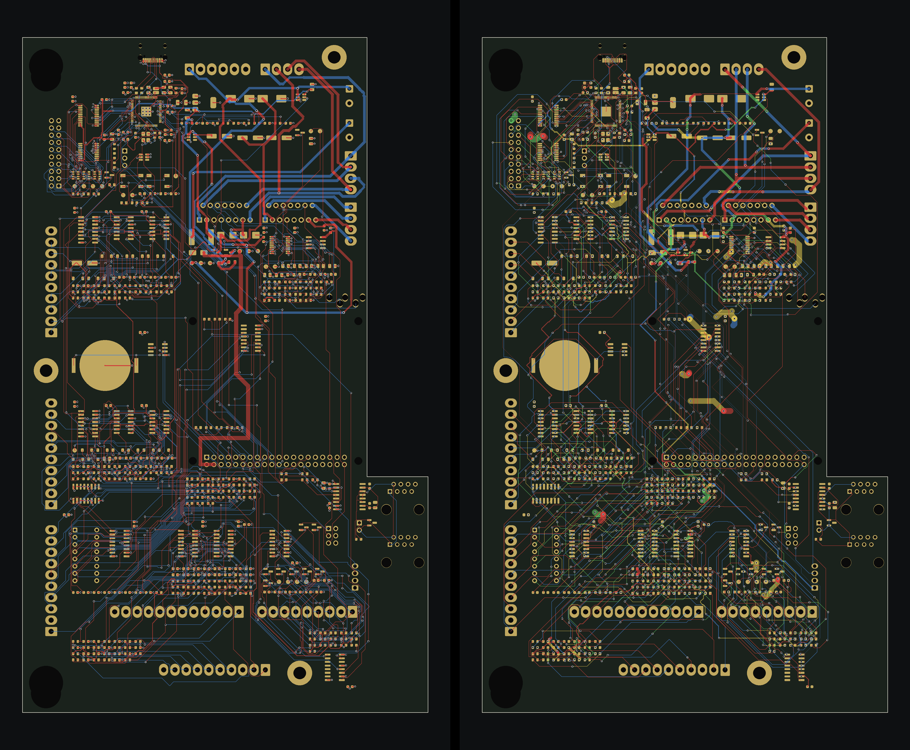

# SAM CPU PPUC, routed with KiCadRoutingTools

A clone of `../sam_cpu/sam_cpu.kicad_pcb` taken from the Freerouting branch (`claude/pcb-placement-r4ey2v` at 9db279a,
draft 0.7, "41 open connections left"), stripped of every track, via and zone fill, and routed again from scratch with
[KiCadRoutingTools](https://github.com/drandyhaas/KiCadRoutingTools) (KRT, commit f2704836, v0.22.1) instead of
Freerouting. Component placement, board outline, zone outlines, net classes and design rules are unchanged; the
hand-routed core regulator and the 1.5 mm +5 V trunk were stripped too.

This folder is an experiment to compare the two routers. The board to keep working on is still `../sam_cpu/`.

Left: the Freerouting board. Right: this one. Red F.Cu, blue B.Cu, green In1.Cu, yellow In2.Cu; pours hidden.

## Result

Both boards graded by `kicad-cli pcb drc --refill-zones` (KiCad 10.0.6) with the project's JLCPCB 4-layer rules
(`sam_cpu.kicad_dru`, copied from `/mnt/project-files/hardware/jlcpcb_rules/`, and the board-setup minimums from its
README in `sam_cpu.kicad_pro`); the net classes (0.15 mm Default clearance and up) still apply. Reports:
`route/drc_*.rpt`.

| | Freerouting (draft 0.7) | KRT (this folder) |
|---|---|---|
| Unconnected items | 41 | **6**: 3 nets at the RP2354B, U24's tab to GND, 2 GND_ISO islands |
| Clearance / short / track crossing | 0 | 0 |
| Copper to board edge (JLC 0.3 mm) | 3 (speaker track, 0.285 mm) | 0 |
| Hole to hole, different nets (JLC 0.5 mm, warning) | 15 via pairs | 0 |
| NPTH hole to copper (JLC 0.254 mm) | 0 | 0 |
| Mounting holes over 6.3 mm (JLC mills them) | 4 | 4 |
| PTH ring under 0.25 mm (footprints, warning) | 4 | 4 |
| Starved thermal reliefs | 6 | 21 (GND pads with one spoke) |
| Dangling track / via stubs | 0 | 7 |
| Tracks / vias | 6096 / 978 | 7298 / 1282 |
| Track length F / In1 / In2 / B (mm) | 8323 / 0 / 0 / 8596 | 7907 / 2025 / 1912 / 6796 |
| Signal track at 0.1 mm | 10 mm | 2693 mm |
| Router time | several Freerouting passes | 73 min main pass + 5 clean-up passes (6-31 min) |

The silkscreen and library reports (199 + 199 + 199 + 5) are identical on both boards and are not routing issues.

Still open on the KRT board:

- `SW_LOAD_N` (U4 pin 17), `BUS_A2` (U4 pin 8) and `FRAME_MOSI` (U4 pin 49 to J21 pin 19): the fan-out stub ends
  1-1.3 mm from its pad, boxed in by the neighbouring pins. Every clean-up pass closed one of these and opened another.
- U24 pin 9 (TDA7297 tab, GND) is not tied to the GND pour.
- GND_ISO stays in 2 islands. Freerouting's board shows the same split, so it comes from the zone and the isolated
  parts, not from the router.

## What to watch

- **Inner layers.** KRT put 3.9 m of signal tracks on In1.Cu (GND plane) and In2.Cu (+3V3 plane), even at three times
  the cost of an outer layer, so both planes are cut in many places. Freerouting kept them clean. A second run with the
  inner layers closed to signals is the fairer comparison; it is being run.
- **Track widths.** With `--escalation board` KRT may shrink a track to the board minimum (0.1 mm) when the requested
  width does not fit. 2.7 m of signals ended at 0.1 mm, and some power paths were necked: `Net-(D1-A1)` (+12 V input
  path) has 25 mm at 0.2 mm instead of 0.8 mm, `+5V` 15 mm at 0.2 mm, `Net-(JP1-B)` 20 mm at 0.2 mm
  (`route/power_widths.py`). Freerouting's narrowest power track was 0.6 mm on those nets. These need widening by hand.
- **Isolation.** KRT has no notion of an isolation gap. The first pass ran `STB_DATA` along the edge of the GND_ISO
  area; it was rerouted with a keep-out polygon on User.2 (the GND_ISO outline grown by 2 mm). No non-isolated copper
  is inside that polygon now (`route/board_stats.py`).
- **RP2354B.** At 0.15 mm clearance the QFN-80's 0.4 mm pads box the router in: without `qfn_fanout.py` first, every
  U4 net failed. With the fan-out, U4 is where the last open nets are.
- **Grid.** A 0.05 mm grid for the whole board was too slow (stopped after 2 hours, 34 nets still open); the main pass
  uses 0.1 mm and only the clean-up passes use 0.05 mm.

## How it was made

`route/route_a.sh` lists the commands in order: strip (`route/strip_routing.py`), refill the zones in KiCad
(`route/fill_zones.py`), fan out U4 with `qfn_fanout.py`, route everything with `route.py`, then clean-up passes on the nets left
open, and a last pass rerouting the 24 nets the JLCPCB rules flagged. KiCad 10 came from the `kicad/kicad:10.0.6` Docker image.
