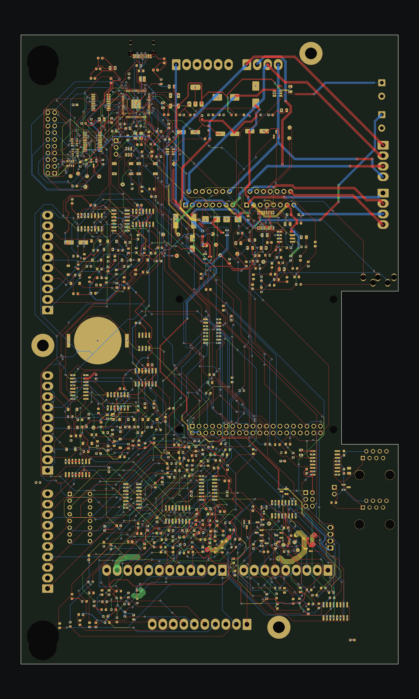

# SAM CPU PPUC: optimized placement, then KRT routing (run C)

The placement plan applied to the KiCadRoutingTools experiment: measure the baseline, write placement constraints,
generate placement candidates scored on ratsnest length and crossings, keep the best two, route them on a copper-free
copy with KRT, pour the zones, and grade with the JLCPCB 4-layer rules. `../` (run A) is left as it was.

`sam_cpu.kicad_pcb` here is the result: the widened candidate, routed and with zones refilled.



Red F.Cu, blue B.Cu, green In1.Cu, yellow In2.Cu; pours hidden.

## Result

Graded by `kicad-cli pcb drc --refill-zones` (KiCad 10.0.6) with `sam_cpu.kicad_dru` (copied from
`/mnt/project-files/hardware/jlcpcb_rules/`) and the JLCPCB board minimums in `sam_cpu.kicad_pro`.

| | Freerouting (0ca768b) | KRT run A (`../`) | **KRT run C (this folder)** |
|---|---|---|---|
| Placement | as drawn | as drawn | widened board, optimized |
| Unconnected items | 37 | 6 | **2**: `GI_PWM` and the Pi's two 3V3 pins (see below) |
| Clearance / short / crossing | 0 | 0 | 0 |
| Hole to hole, different nets (JLC 0.5 mm) | 5 | 0 | 0 |
| Copper to edge (JLC 0.3 mm) | 0 | 0 | 0 |
| Starved thermal reliefs | — | 21 | 15 |
| Dangling track / via stubs | — | 7 | 6 tracks, 0 vias |
| Signal track at 0.1 mm | — | 2693 mm | **0** (`--escalation off`) |
| Tracks / vias | — | 7298 / 1282 | 6033 / 1147 |
| Track length F / In1 / In2 / B (mm) | — | 7907 / 2025 / 1912 / 6796 | 8005 / 1522 / 1479 / 6150 |
| Non-isolated copper in the GND_ISO area | — | none | none |

The remaining DRC items (199 silk overlap, 120 silk over copper, 199 library, 5 silk to edge, 4 mounting holes over
6.3 mm, 4 PTH rings) are the same as on the other boards and are not routing issues. Report: `drc/drc_widened_final.rpt`.

Still open:

- `GI_PWM` (U4 to the R185 area near U15): the end at (97.8, 119.95) is boxed in by neighbouring tracks. Three passes,
  including one allowed to rip the blocking nets, did not close it. It is one short track to add by hand.
- `unconnected-(J21-3V3-Pad1)`: the schematic leaves the Pi header's two 3V3 pins (1 and 17) on one no-connect net,
  so KiCad asks for them to be joined. The Pi ties them internally; fix it in the schematic (no-connect flags) rather
  than on the board.

Power tracks still under their class width (requested width not reached in a tight spot; no track went below 0.2 mm):
`Net-(JP1-B)` 26.6 mm at 0.2 instead of 0.8, `Net-(D1-A1)` 12.7 mm at 0.2 instead of 0.8, `+12V` 3.6 mm at 0.4,
`+5V` 5.2 mm at 0.2, `+3V3` 35.8 mm and `+1V1` 12.4 mm at 0.2 instead of 0.25. The JP1-B and D1-A1 sections should
be widened by hand (`scripts/power_widths.py`).

## Placement metrics

Ratsnest = sum of per-net minimum spanning trees over pad centres, without GND, +3V3 and GND_ISO (planes);
crossings = ratsnest segments crossing each other (`scripts/ratsnest.py`).

| Candidate | Ratsnest (mm) | Crossings | Notes |
|---|---|---|---|
| baseline (Freerouting 0ca768b placement) | 14534 | 3391 | |
| c1: U6/U7 swap with their caps | 14514 | 3438 | 1 courtyard overlap, dropped |
| c2: optimizer, 3 mm max move | 14052 | 2389 | |
| c3: swap + 3 mm | 14007 | 2482 | |
| c4k: swap + 6 mm, decap groups, heatsink keep-out | 13642 | 1928 | routed: 286/304 first pass |
| **c5k: widened board + swap + 10 mm, decap groups, heatsink keep-out** | **13391** | **1391** | routed: 297/304 first pass |

Both kept candidates have no courtyard or clearance overlaps, nothing in the heatsink area (x 89-137, y 71-84) and no tall
parts under the Pi. The optimizer scatters and rotates passives more than a hand layout would
(`placement_before_after.png`, baseline left, widened right); a tidy-up pass for assembly and silkscreen is still needed.

**The widened board.** The top-right part of the board was extended by 21.35 mm to x 172 (KiCad coordinates), from the
top edge down to y 126.5, where a notch keeps the Pi's overhang free. The right-edge connectors J17, J22, J23, J24 and
J30 moved right with the edge by 21.35 mm; no mounting hole moved. Check that the harness reaches the new connector
positions before keeping this.

Locked parts (`locks.txt`, `placement_constraints.yaml`): all connectors, mounting holes, SW1-3, BT1, JP1, U23/U24
(heatsink), the isolated RS485 parts and U4 with its regulator parts.

## Routing

The original-size candidate ended with 8 nets open after its clean-up pass, so only the widened one was finished.

1. `scripts/route_chain.sh`: refill zones, fan out U4 with `qfn_fanout.py`, route the isolated nets, add a keep-out
   on User.2 around GND_ISO (outline + 2 mm), then route everything else. Layer costs 1/3/3/1, grid 0.1 mm,
   `--escalation off` (no narrowing), `--hole-to-hole-clearance 0.5`. Widened board: 79 min.
2. `scripts/route_cleanup.sh`: open nets plus GND at 0.05 mm grid (13 min), then the last two nets (3 min).
3. GND pad taps: the outer GND pours were removed from a copy, GND routed so every GND pad gets its own via into the
   In1 plane, and the pours put back. This closed the last 20 GND pads the pours did not reach.
4. `kicad-cli pcb drc --refill-zones --save-board` with the JLC rules.

Stage files: `stages/0_baseline_unrouted.kicad_pcb` (copper stripped), `stages/1_placed_widened.kicad_pcb` and
`stages/1_placed_original_size.kicad_pcb` (optimized, unrouted). Placement commands (KRT `py_placer/place_optimize.py`):

```
place_optimize.py c5_wide.kicad_pcb c5k.kicad_pcb --max-displacement 10 --ignore-nets GND +3V3 GND_ISO \
  --lock $(cat locks.txt) --group-by decap --intent intent.json
```

`c5_wide` is the baseline with U6/U7 swapped (`scripts/move.py`), the outline and zones widened (`scripts/widen.py`)
and the right-edge connectors moved. `c4k` uses `--max-displacement 6` on the original outline.
