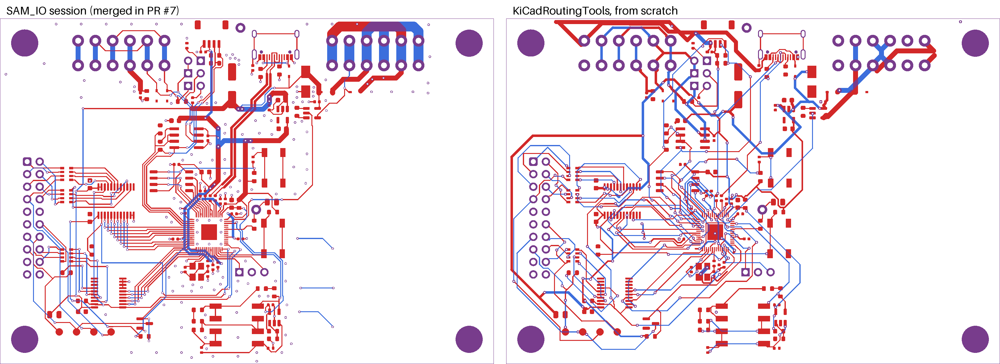

# SAM_IO board, routed with KiCadRoutingTools

A clone of `../sam_io/sam_io.kicad_pcb` as merged in PR #7. Every track, via and zone fill was stripped, and the
board was routed again from scratch with [KiCadRoutingTools](https://github.com/drandyhaas/KiCadRoutingTools)
(KRT, commit f2704836, v0.22.1). Component placement, the 100 x 70 mm outline, the mounting holes and the GND pour
outline are unchanged. The copper that came over from PPUC's IO_16_8_1 (RP2040, flash, USB, RS485, power) was
stripped too, so this is the whole board, not just the SAM bus.

This folder is an experiment for comparing the two layouts. Keep working on `../sam_io/`.

Left: `../sam_io/`. Right: this folder. Red is F.Cu, blue is B.Cu and purple is both. The GND pour on both layers
is hidden.

## Result

Both boards were graded with `kicad-cli pcb drc --refill-zones --severity-all` (KiCad 10.0.6). Reports are in
`route/drc_*.rpt`.

**JLCPCB 2-layer rules.** These use `sam_io.kicad_dru` (the project's `hardware/jlcpcb_rules/jlcpcb_2layer.kicad_dru`)
and its board setup minimums. The netclasses are each board's own.

| | SAM_IO session (`../sam_io`) | KRT (this folder) |
|---|---|---|
| Unconnected items | 0 | **3** (see below) |
| Clearance / short | 0 | 0 |
| Copper to edge (0.3 mm) | 1 (GND via at the bottom edge) | 0 |
| Hole to hole, different nets (0.5 mm) | 1 (`/A` and `/B` vias, 0.76 mm apart centre to centre) | 1 (`/1V1` and GND vias by U3) |
| NPTH hole to copper | 4 (USB-C J4 footprint) | 4 (same) |
| PTH ring under 0.25 mm (warning) | 4 (USB-C J4 shield) | 4 (same) |
| Starved thermal reliefs | 4 | 11 |
| Dangling track | 0 | 1 (a 0.016 mm +3V3 stub) |
| Silkscreen overlaps (warning) | 132 | 132 (same, not routing) |

**The board's own rules** (`../sam_io/sam_io.kicad_pro`: 0.2 mm clearance, 0.33 mm hole clearance):

| | SAM_IO session | KRT |
|---|---|---|
| Unconnected items | 0 | 3 |
| Clearance | 0 | 222 (all between 0.15 and 0.2 mm, by design, see below) |
| Hole clearance (0.33 mm) | 6 | 11 |

**Copper**

| | SAM_IO session | KRT |
|---|---|---|
| Tracks / vias | 1086 / 289 | 1207 / 206 |
| Track length F.Cu / B.Cu | 1504 / 690 mm | 1181 / 1036 mm |
| Signal tracks | 0.2 mm (53 mm at 0.5) | 0.2 mm only |
| `/5V_IN`, `/Out_S` (power in, special out) | 1.0 mm, but `/Out_S` 16 mm at 0.2 | 1.0 mm throughout |
| `+5V` below 0.5 mm | 110 of 142 mm | 10 of 186 mm (neck-downs at pads) |
| `+3V3` below 0.3 mm | 136 of 230 mm | 43 of 222 mm (neck-downs at U3 and the caps) |
| RS485 `/A`, `/B` below 0.5 mm | 81 of 101 mm | 0 |

**Time**

| | |
|---|---|
| KRT, final chain (`route/route_krt.sh`) | **18 min wall clock** on 4 cores: fan-out and main pass 931 s, clean-up pass 145 s |
| KRT, finding the settings | about 1 h 30 min: 13 setups, up to four at a time, before the final chain |
| SAM_IO session | about 1 h 30 min (18:13 to 19:40 on 2026-10-07, from the thread's progress updates), routing only the 19 new SAM bus parts. Two Freerouting passes and hand-routed RP2040 fan-out and fixes. The rest of the copper came routed from IO_16_8_1 |

The two times are not the same job: the SAM_IO session routed the new parts into a board that was already mostly
routed, while KRT routed all 93 nets from nothing.

## Still open on the KRT board

- **`+3V3` at U3 pin 22** (IOVDD, bottom edge of the RP2040): not connected. Its neighbours on that edge box it in. It needs a short hand-routed track or via before this board could be built.
- **GND at Y1 pad 4**: the crystal's ground pad is not joined to a short GND stub next to it, so it hangs off the pour.
- 11 starved thermal reliefs on GND pads (pads with one spoke instead of two).

## What to watch

- **0.15 mm clearance.** The SAM_IO board uses a 0.2 mm Default netclass. At 0.2 mm KRT could not escape the
  RP2040's 0.4 mm pitch pads: 11 setups (0.1 and 0.05 mm grid, with and without `qfn_fanout.py`, rip-up of the
  fan-out stubs, narrower power tracks) all left 19 to 35 nets open around U3. At 0.15 mm it closes all but one.
  So this copy's Default netclass is 0.15 mm, which is above JLCPCB's 0.10 mm 2-layer limit. The hand-routed
  original holds 0.2 mm because its RP2040 lines leave the pads straight, which KRT's 45 degree fan-out cannot do
  at that pitch.
- **Vias are 0.6 / 0.3 mm**, not the board's 0.5 / 0.3 mm. With a 0.5 mm via, 0.2 mm clearance from its copper
  is only 0.3 mm from its hole, under the board's 0.33 mm hole clearance (the first run hit 25 of those).
- **Power widths.** Lessons from the CPU board's KRT run (PR #8) are applied: no plane layers here,
  `--escalation off` so nothing is drawn under the asked width, and fixed power widths from the start (`/5V_IN`
  and `/Out_S` 1.0 mm, `+5V` and RS485 0.5 mm, `+3V3`, `/1V1` and GND 0.3 mm). The only narrower power copper
  is KRT's neck-down where a track lands on a fine-pitch pad.
- **Layer balance.** KRT uses both layers about equally. The SAM_IO board keeps two thirds of its copper on
  F.Cu, so its bottom GND pour is less cut up.

## Placement experiment

Does moving parts into the empty right half help? Following the project's placement-then-routing plan, four
KRT placer candidates (`place_optimize.py`, connectors, SWD header, DIP switch and holes locked; see
`placement/placement_constraints.yaml`) and two hand-built ones (`placement/shift.py`: the RP2040 block moved
rigidly 19 mm right, the buttons and LED 20 or 24 mm) were scored, and the best three were routed with the same
KRT settings as above. Unconnected counts are KiCad DRC after routing. All figures: `placement/metrics.csv`.

| Placement | HPWL | Airwire crossings | Unconnected at 0.2 mm | Unconnected at 0.15 mm |
|---|---|---|---|---|
| Original (this folder) | 1759 mm | 240 | 25 | **3** |
| KRT placer, best of 4 | 1944 mm | 79 | 28 | |
| RP2040 block moved right | 2117 mm | 242 | 23 | 6 |
| Same, buttons further right | 2133 mm | 242 | 26 | 5 |

No placement beat the original. Every open net is at the RP2040's own pins, so the limit is getting out of
its 0.4 mm-pitch pads at 0.2 mm clearance, not space on the board. The KRT placer also pulled decoupling caps
and the crystal away from U3 (`placement/candidate_krt_placer.png`), which the constraints rule out, so its
lower crossing count does not make it usable. Each routing run took 14 to 22 minutes, three at a time on 4 cores.
The board in this folder keeps the original placement.

## How it was made

`route/route_krt.sh` lists the commands in order: strip (`route/strip_routing.py`), refill the pour in KiCad
(`route/fill_zones.py`), fan out U3 with `qfn_fanout.py`, route everything with `route.py`, then one clean-up
pass that may rip up any net. KRT ran inside the `kicad/kicad:10.0.6` Docker image so it could use KiCad's
own zone filler. `route/stats.py` prints the copper figures above.
